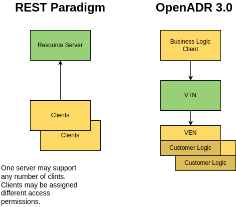
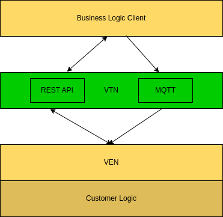
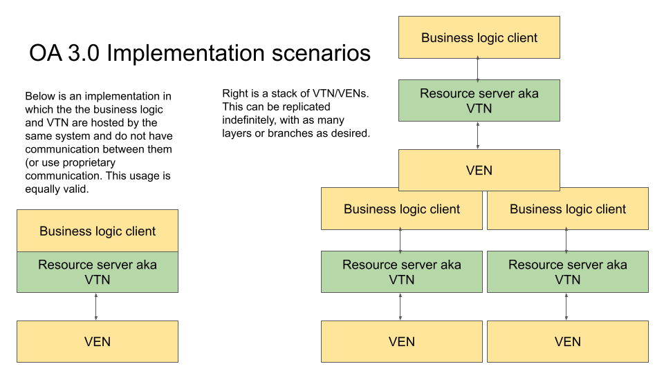
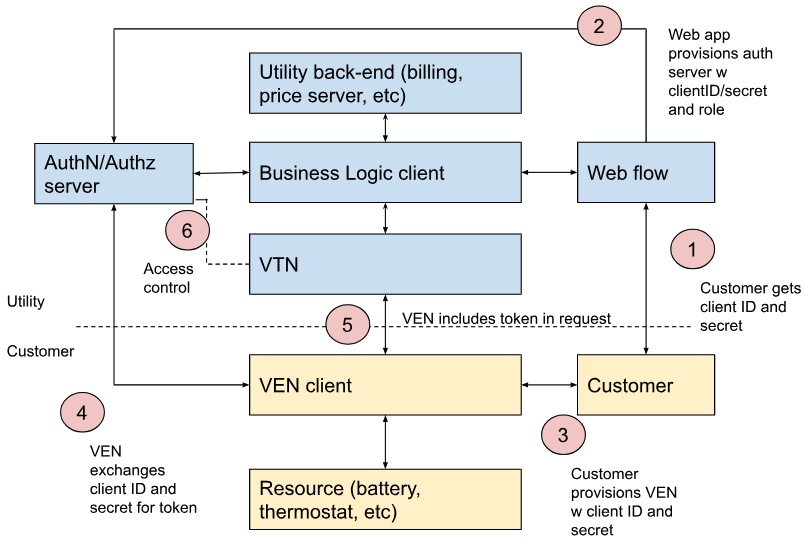

::: #title-page
{.logo-image}


::: .text-right .font-weight-bolder
**OpenADR 3.0**

**OpenADR 3.1.0 Definitions**
:::

::: .text-right 
Updated 9/16/2024

Revision Number: 3.1.0

Document Status: **Final** **Specification**

Document Number: 20231118-X
:::

TODO: This table does not align to the right, but is centered.

| Contact:              | Editors:               | Technical Director OpenADR Alliance:          |
|-----------------------|------------------------|--------------------|
| OpenADR Alliance      | Frank Sandoval -       | Rolf Bienert       |
|                       | Pajarito Technologies  | <rolf@openadr.org> |
| 111 Deerwood Road,    | LLC                    |  |
| Suite 200             |                        |                    |
|                       | Bruce Nordman -- LBNL  |                    |
| San Ramon, CA 94583   |                        |                    |
|                       | Other OpenADR Alliance |                    |
| USA                   | Members                |                    |
|                       |                        |                    |
| <info@openadr.org>    |                        |                    |

<p class="text-right">Please send general questions and comments about the specification to
[comments@openadr.org](mailto:comments@openadr.org).</p>


:::

<!-- div style="page-break-before: always; page-break-after: always;"> <!-- Your page Content -->

# CONTENTS { #contents .page_break}

TODO: The Table of Contents  should have a page break before and after?

TODO: Automatic numbering of ToC items?

[[toc]]

<!-- /div -->

# Introduction {.page_break}

This document describes the third major iteration of the OpenADR
protocol. It serves as a near functional equivalent of its predecessor,
OpenADR 2.0b, but departs from the 2.0b SOAP-like web service design and
instead adheres to RESTful web service best practices. REST services are
much more common today than SOAP and are generally considered much more
straightforward to use and troubleshoot. The main goal in providing this
version as a complement to 2.0b is to lower the barriers of entry for
new implementers and thereby encourage more widespread adoption of the
standard.

This document contains normative and non-normative content and may
contain simplifications for the purpose of conveying the underlying
OpenADR REST concepts. Additional normative content can be found in the
Normative References section, including the OpenADR 3.0 OpenAPI
document. [OADR-3.0-Specification] which is the authoritative
specification of the interface between VTN and clients.

## 1.1 Revision 3.0.2 Introduction {#revision-3.0.2-introduction .unnumbered}

The 3.0 revision supported a single mechanism (webhooks, via HTTP) for
the Virtual Top Node (VTN) to push notifications to clients (resulting
from Subscriptions), this revision adds support for notification event
delivery via standard messaging protocols, with MQTT being the first
such messaging protocol defined.

# Normative References

[OADR-3.0-Specification] OpenADR 3.0 OpenAPI YAML (SwaggerDoc) Specification, [[https://github.com/oadr3/openapi-3.0.0]](https://github.com/oadr3/openapi-3.0.0)

[ISO 8601] ISO date and time format. https://www.iso.org/iso-8601-date-and-time-format.html

[ISO 4217] ISO 4217 Currency Codes:
[[https://www.six-group.com/en/products-services/financial-information/data-standards.html#scrollTo=maintenance-agency]](https://www.six-group.com/en/products-services/financial-information/data-standards.html%23scrollTo=maintenance-agency)

[MQTT] MQTT Version 5.0:
[[https://docs.oasis-open.org/mqtt/mqtt/v5.0/mqtt-v5.0.html]](https://docs.oasis-open.org/mqtt/mqtt/v5.0/mqtt-v5.0.html)

# Informative References

[OADR-3.0-User_Guide] OpenADR 3.0 User Guide, Draft April 17, 2023

[OADR-3.0-Introduction] OpenADR 3.0 Introducing OpenADR 3.0, Draft April 17, 2023

[OADR-3.0-Reference_Implementation] OpenADR 3.0 Reference Implementation [[https://github.com/oadr3/RI-3.0.0]](https://github.com/oadr3/RI-3.0.0)

[REST_Best_Practice] RESTful web API design (website) [[https://docs.microsoft.com/en-us/azure/architecture/best-practices/api-design]](https://docs.microsoft.com/en-us/azure/architecture/best-practices/api-design)

[CTA-2045-B] Modular Communications Interface for Energy Management, November 2020

[OpenAPI Auth] Authentication in OpenAPI [[https://swagger.io/docs/specification/authentication/]](https://swagger.io/docs/specification/authentication/)

[REST-API-Best_Practices] REST API Security Essentials. [[https://dzone.com/refcardz/rest-api-security-1]](https://dzone.com/refcardz/rest-api-security-1)

[OAuth] The OAuth 2.0 Authorization Framework, 2012. [[https://www.rfc-editor.org/rfc/rfc6749]](https://www.rfc-editor.org/rfc/rfc6749)

[JWT] JSON Web Token (JWT), 2015. [[https://www.rfc-editor.org/rfc/rfc7519]](https://www.rfc-editor.org/rfc/rfc7519)

[Oauth2 Client Flow] OAuth 2.0 Client Credentials Grant. [[https://oauth.net/2/grant-types/client-credentials]z](https://oauth.net/2/grant-types/client-credentials)

[Client Flow Overview] Client Credentials Flow. [[https://auth0.com/docs/get-started/authentication-and-authorization-flow/client-credentials-flow]](https://auth0.com/docs/get-started/authentication-and-authorization-flow/client-credentials-flow)
[SEMVER] Semantic Versioning [[https://semver.org]](https://semver.org)

[TLS] How SSL and TLS provide identification, authentication, confidentiality, and integrity,

[[https://www.ibm.com/docs/en/ibm-mq/7.5?topic=ssl-how-tls-provide-authentication-confidentiality-integrity]](https://www.ibm.com/docs/en/ibm-mq/7.5?topic=ssl-how-tls-provide-authentication-confidentiality-integrity)

[URI] Uniform Resource Identifier (URI): Generic Syntax [[https://www.rfc-editor.org/rfc/rfc3986]](https://www.rfc-editor.org/rfc/rfc3986)

# Terms and Definitions

OpenADR 3.0 adopts many terms from 2.0b directly, such as Event and
Report. Terms that are new or modified are:

- **Program** - The business context for a given usage of the VTN. May be a Demand Response program, tariff, or other business construct.
- **ProgramName** - A unique name for a program or tariff. May be used by customers.
- **[Program Description]** - A human readable document provided out-of-band by a Business Logic entity that specifies a usage of the OpenADR 3.0 object model and configuration details such as VTN address, program names, applicable customer types, etc.
- **Tariff** - A type of program that defines the basic agreement between a retailer and a customer, such as an electricity pricing structure, as opposed to optional programs offered on top of a tariff.
- **Virtual Top Node (VTN)** - An application that implements the OpenADR 3.0 APIs. This is a Resource Server in REST parlance.
- **Virtual End Node (VEN)** - A software application that consumes events, generates reports, and directly or indirectly causes changes in energy consumption patterns. This is a client of a VTN.
- **Business Logic (BL)** - Application logic embodied in one or more software applications deployed by a utility, retailer, or other 'program owner' of the VTN that typically produces events and consumes reports. It may be incorporated into the VTN resource server such that the business logic application exposes the OpenADR 3.0 API. We use the term here to refer to a client of a VTN.
- **Customer Logic (CL)** - Application logic that requests and responds to program and event objects, produces reports, and may provide human facing features to support configuration and monitoring. May be incorporated into or interface with a VEN client.

## 4.1 Messaging Protocol Terms and Definitions {#messaging-protocol-terms-and-definitions .unnumbered}

- **Broker** - The standard term for the \"server\" component of a messaging protocol system. VTNs implementing an additional messaging protocol would include at least one messaging broker.
- **Topic** - A category used to organize messages. Each topic has a name that is unique to the broker.
- **Client** - A client connects to a broker, in order to write or read messages.
- **Publisher/Producer** - A client that writes messages to a topic on a broker.VTNs implementing this proposal would be publishing clients
- **Subscriber/Consumer** - A client that reads messages from a topic on a broker. Typically the subscribing client will subscribe to a topic, and subsequently receive (read) messages published to that topic. VENs implementing this proposal would be subscribing clients.
- **Binding** - A specification (and implementation) of a specific messaging protocol technology to the OpenADR 3.0.2 Messaging Protocol endpoints/extensions. This revision specifies the binding to the MQTT protocol. Future revisions may specify additional bindings, one potential future binding may be to Kafka.
- **Subscribe-able Object** - An OpenADR 3 object that can be subscribed to, resulting in subsequent notifications of changes to the subscribed object are sent to the subscriber. OpenADR 3 subscribe-able objects include: PROGRAM, EVENT, REPORT, SUBSCRIPTION, VEN, and RESOURCE.

# Overview

## System Architecture

REST systems are composed of a Resource Server exposing a set of HTTP
APIs and multiple clients of the API. An OpenADR 3.0 VTN is a Resource
Server, and like an OpenADR 2.0b VTN it provides a mechanism for
business logic of a utility or other entity to transmit events and
receive reports to and from an energy consuming client, known as a VEN.

OpenADR 3.0 defines a RESTful interface that is used by both business
logic clients and customer logic clients, aka VENs, which represent
flexible loads and other customer devices. In this model, an OpenADR 3.0
Resource Server (VTN) provides a mechanism for business logic and energy
consumers to exchange events and reports. Figure 1 illustrates the
canonical REST paradigm of server and clients, and how OpenADR terms are
applied to these constructs.

{.margin-left-auto .margin-right-auto}

**Figure 1. REST and its application to OpenADR**

Business Logic (BL) is application software hosted by an energy retailer
that integrates to the retailers backend systems and interfaces with a
VTN. It may also support an onboarding process, including a User
Interface, by which VENs are provided security credentials and other
configuration information (e.g. VTN URL).

Customer Logic (CL) uses a VEN client to obtain demand response events
produced by BL and subsequently manage a set of 'resources' such as
flexible loads and customer devices. CL may expose a User Interface to
facilitate configuration and management of the VEN, e.g. configure VTN
address.

An implementation of an OpenADR 3.0 system might incorporate Business
Logic (BL) into a VTN, such that certain API features are not used by
the BL and instead implementation specific mechanisms are used to
support BL functions.

OpenADR 3.0.2 VTNs supporting notifications via messaging protocols will
include one (or more) messaging brokers. VTN clients will make (newly
defined) REST requests to the VTN to determine the VTN's support for
messaging protocol bindings, and if supported, details of message broker
connection information, and the topic names available for subscribable
object notifications. A VTN will include a broker for each supported
messaging protocol, if any. The relationships between the VTN's REST and
message protocol broker, and potential clients are shown in Figure 1.5



**Figure 1.5**

A tiered hierarchy of VTNs and VENs may also be supported, in which an
entity acts as a VEN to interact with a VTN, and then presents its own
VTN to 'downstream' VENs. This is shown in Figure 2.



**Figure 2. OpenADR 3.0 example implementation scenarios**

## Local Scenarios

A common expected future usage of OpenADR will be for a central device
in a building to receive OpenADR events as a VEN, then rebroadcast
these - possibly modified - to local flexible loads and other devices.
The term 'local' is applied to match IT usage as with a Local Area
Network; this is distinct from 'locational' to refer to a geographic
region, as with locational retail prices. The central device might be a
large building energy management system, a central hub for a collection
of local devices (e.g. for the Matter protocol), a microgrid controller,
or even just a Wi-Fi access point. The device is then a VTN for the
local devices. This is an example of the use of a hierarchy of OpenADR
links as in the right side of Figure 2.

There are several cases in which centralizing the reception of retail
prices is beneficial. Only one device needs to be aware of the identity
of the retailer and tariff, so that if these change only one device
needs to be updated. Another case is when the customer wishes to
incorporate the burden of greenhouse gas emissions into the optimization
of loads and other devices, and do so with a 'local price'; the GHG
value is multiplied by a \$/ton burden value and added to the retail
price. The localPrice boolean in a program description notifies
downstream devices that the retail price has been modified. Another use
of a central device is to receive OpenADR signals over multiple
communication channels for redundancy. Yet another is for microgrid
operation when the grid is down - the central device can be a microgrid
controller and use OpenADR events, e.g. prices, to balance supply and
demand.

It is not anticipated that the OpenADR standard needs to be modified in
any way to fully support local operation, but any changes would be
supplementary capabilities.

## VEN enrollment

OpenADR relies on an out-of-band process by which Business Logic (BL)
entities (e.g. utilities) and VENs/Customer Logic agree on the specifics
of a 'program' or 'tariff'. A 'program description' may be provided by
the BL entity that specifies event structure, reporting requirements,
and other details of a program or tariff. In general, VENs must enroll
with a BL entity to receive security credentials. These credentials are
used by a VTN to Authenticate and Authorize VEN requests. A VEN on a
tariff and some programs may not need to be authenticated to the VTN.

A BL entity provides a web flow or other mechanism to onboard VENs into
(non-tariff) programs. This commonly involves action by the Customer. A
VTN may choose to make some programs freely available, such as those
that are for a tariff and, for example, only distribute prices and
similar information.

Every electric utility customer is on a tariff. This is often a default
or assigned by the utility based on customer characteristics. This
assignment or selection of a tariff is the out-of-band process for a
customer that will then want to receive the prices for that tariff.
Tariffs also have a program description as other demand response
coordination mechanisms have, though it is usually simpler.

# General Usage

## VTN provided fields

On object creation of programs, events, reports, subscriptions, vens,
and ven resources, client representations provided to the VTN on POST
requests are incomplete, as clients do not have the context to provide
accurate or meaningful values for the following attributes:

- objectID

- createdDataTime

- modificationDateTime

- objectType

A VTN SHALL populate object representations with the above fields on
object creation.

## Required and optional properties

The specification is purposefully sparse of required fields so that
clients may create and modify objects by creating requests with minimal
effort.

If a representation sent to the VTN lacks a required property, a VTN
SHALL return a 400, Bad Request response. A resource is not created or
updated. Required fields do not have default values.

A representation provided in a write request (PUT, POST) to the VTN may
exclude optional fields. The VTN may create a corresponding object with
such excluded fields set to default values.

A VTN may provide representations of an object that do not include
optional properties that have their default value.

Optional fields are generally nullable and have default values of null,
where no assumption can be made on what reasonable a default value might
be.

If a representation includes a property that is not defined by an
object's schema, a VTN may create a corresponding resource without the
additional property, effectively ignoring the additional content.

## Response Codes and Errors

A VTN SHALL support the following standard codes:

GET

200 - OK

400 - Bad Request

403 - Forbidden

404 - Not Found

500 - Internal Server Error

POST

201 - Created

400 - Bad Request

403 - Forbidden

404 - Not Found

409 - Conflict (item already exists)

500 - Internal Server Error

PUT

200 - OK

400 - Bad Request

403 - Forbidden

404 - Not Found

409 - Conflict

500 - Internal Server Error

DELETE

200 - OK

400 - Bad Request

403 - Forbidden

404 - Not Found

500 - Internal Server Error

Servers may implement other response codes, but VENs might not recognize
them.

### Problem

On 40x and 500 responses, a VTN SHALL respond with a *problem* object
that contains details of the error. The problem object is intended to
help clients determine what caused a particular response, such as Bad
Request, Unauthorized, Forbidden, etc.

For example:

problem

```json
{
  "title": "Not Found",
  "status": 404,
  "detail": "Unrecognized URL"
}
```

**Figure 3. Problem Example**

## POST and PUT

POST is used to create new objects, and PUT is used to update an
existing object. A VTN SHALL ignore objectID, createdDateTime,
modificationDateTime, and objectType values included in representations
used in POST and PUT requests.

## Compression

In some circumstances the size of responses should be minimized, such as
over bandwidth-constrained connections.

The HTTP protocol allows a client to request encoding using one of
several compression algorithms, such as GZIP, by using the
Accept-Encoding header. Server responses can then use the
Content-Encoding header to indicate the algorithm chosen, and the
response body is compressed accordingly. The result should be a seamless
exchange where data is compressed.

Configuring this behavior is outside the scope of the OpenAPI definition
of the OpenADR protocol. Instead, compression is implemented through
configuration of the HTTP/REST framework used for OpenADR clients and
servers.

Support for a given compression format is optional for VTNs, although
gzip is encouraged.

## Support for Strongly Typed languages

Certain OpenAPI construct, such as oneOf and anyOf are not suited to
code-generation of client or server stubs in strongly typed languages
like Java and C#. Code generators could operate if such constructs
explicitly included a super class with the alternative schemas modeled
as subclasses, but this is not implemented in OpenADR 3.0. Where OpenADR
3.0. uses oneOf and anyOf , classes should be manually created in some
languages.

## Message validation

A VTN SHALL reject request bodies that do not contain required fields.
Content that is not described by a message schema MAY be ignored. (See
Section 9.1 Model Extension). Validation of content by a VTN content is
outside the scope of this specification and is considered an
implementation detail.

Content validation is the responsibility of clients and therefore
outside the scope of this specification.

## Subscriptions

OpenADR 3.0 supports both pull and push interactions. Pull interactions
are initiated by a client and are implemented with HTTP GET, POST, PUT,
and DELETE.

Push interactions are implemented with Subscriptions via webhooks. These
allow a client to be notified when certain operations transpire. A
webhook is a client endpoint registered with the VTN. When a specified
operation occurs, for example when an event is created, a request to the
client endpoint may be made by the VTN, thus notifying the client of the
new event.

Webhooks are implemented using subscription objects. A client creates a
new subscription object, which contains the webhook callback URL, and a
description of the objects and operations that will trigger a request to
the callback URL.

POST subscription

```json
{
  "clientName": "myClient",
  "programID": "44",
  "objectOperations": [{
    "callbackUrl": "https://myserver.com/callbacks",
    "operations": [
      "POST",
      "PUT"
    ],
    "objects": [
      "EVENT",
      "PROGRAM"
    ]
  }]
}
```

**Figure 4. Subscription**

A subscription object is associated with a specific client and specific
program. The objectOperations list specifies what operations on which
resource types the client requests to be notified about.

A client may provide multiple resourceOperation entries to provide
different callbackUrls to catch notifications of different resources and
operations.

POST subscription

```json
{
  "clientName": "myClient",
  "programID": "44",
  "objectOperations": [
    {
      "callbackUrl": "https://myserver.com/event_callbacks",
      "operations": [
        "POST",
        "PUT"
      ],
      "objects": [ 
        "EVENT"
      ]
    },
    {
      "callbackUrl": "https://myserver.com/program_callbacks",
      "operations": [
        "POST",
        "PUT"
      ],
      "objects": [
        "PROGRAM"
      ]
    }
  ]
}
```

**Figure 5. multiple callback Subscription**

A VTN SHALL make a request to the callback URL when the conditions are
met per the objectOperations registered subscriptions. The callback
request body is a Notifications object that indicates the object type of
the resource, the operation that provoked the request, and the relevant
resource object.

Notification

```json
{
  "objectType": "PROGRAM",
  "operation": "POST",
  "object": {
    "bindingEvents": false,
    "createdDateTime": "2023-06-15T15:51:29.000Z",
    "id": "0",
    "localPrice": false,
    "objectType": "PROGRAM",
    "programName": "myProgram"
  }
}
```

**Figure 6. Notification Example**

## 6.8.1 Subscription and Notification via Messaging Protocols {#subscription-and-notification-via-messaging-protocols .unnumbered}

As an alternative to object Subscriptions via REST and resulting
Notifications via webhooks, revision 3.0.2 defines an alternate
mechanism based on standard messaging protocols, initially MQTT only.

A client may request information about supported messaging protocol
brokers via the GET /brokers request:

GET /brokers

```json
{
  "bindings": {
    "mqtt": {
    "connectionURI": "mqtts://broker.vtn.company.com",
    "serialization": "json",
    "auth": One of: "anonymous", "clientID-token", "cert"
    "certs": {
      "ca_crt": "string containing the Certificate authority certificate",
      "client_crt": "string containing the client certificate",
      "client_key": "string containing the client private key"
    }
  }
}
```

**Figure 7. GET / brokers Example**

The client may then connect to the VTN's message broker, and request
topic names available for subscription. The topic-name request
endpoints:

- `GET /brokers/mqtt/topics/programs`
- `GET /brokers/mqtt/topics/programs/{programID}`
- `GET /brokers/mqtt/topics/programs/{programID}/events`
- `GET /brokers/mqtt/topics/programs/{programID}/reports`
- `GET /brokers/mqtt/topics/programs/{programID}/subscriptions`
- `GET /brokers/mqtt/topics/vens`
- `GET /brokers/mqtt/topics/vens/{venID}/resources`

An example request and response:

GET /brokers/mqtt/topics/programs

```json
{
  "request": "brokers/mqtt/topics/programs",
  "topics": {
    "CREATE": "programs/create",
    "UPDATE": "programs/update",
    "DELETE": "programs/delete",
    "ALL": "programs/+"
  },
  "binding": "mqtt"
}
```

The response from the VTN is a JSON object, containing the following
keys:

* request - A copy of the request URL path, with no leading "/"
* topics - A JSON object, each key being the operation on the object, and the value of that key is the topic-name for that operation
* binding - Always "mqtt" for MQTT topic names

Unlike the Subscriptions REST request, response filtering (see section
6.9 below) is not supported for topic subscriptions made via messaging
protocols. If a client subscribes to an object's operations, it will
receive all such notifications, and it is the responsibility of the
client to ignore/filter events to which it is not interested.

The format and content of the notification messages received by clients
will be the same as the existing notification JSON response format
specified in OpenADR 3.0 (which is also the same as what is returned
when the message is obtained via an OpenADR 3.0 REST GET request).

## Response Filtering

A VTN may support large numbers of objects, such as vens and associated
resources. In order to reduce potentially large responses that might
include object representations of no interest to a client, clients may
provide query params to allow a VTN to filter results.

For example, when requesting a list of reports, a client may specify,
through query params, that only reports associated with a specific
program, and/or created by a specific client, be included in a response.

Targeting criteria can be used to filter responses to include only those
objects that are targeted to specific vens and resources.

Program, event, and subscription objects may contain lists of targets
which indicate sets of vens and resources that are the intended
recipients of these objects. Vens and resources may include their own
targeting criteria to expose their target attributes.

Filtering query params are applied to the following operations:

* `GET <>/programs: targets`
* `GET <>/reports: programID, clientName`
* `GET <>/events: programID, targets`
* `GET <>/subscriptions: programID, clientName, targets`
* `GET <>/vens: targets`
* `GET <>/vens/{venID}/resources: targets`

VTN SHALL support limit and skip query params on GET operations, as
described by [OADR-3.0-Specification], to control pagination of
potentially large responses.

VTN SHALL treat filtering params as additive, that is, results must
match every filter term.

Future versions of OpenADR3 may provide other features that facilitate
massive scalability or operation under extremely bandwidth or memory
constrained environments.

## Object names

Some objects have name attributes that can be used as query parameters
to retrieve them. This requires uniqueness with given scopes.

* `program.progranName` - must be unique to a VTN instance.
* `ven.venName` - must be unique within the scope of a VTN instance.
* `ven.resource.resourceName` - must be unique to its associated ven.

event and report names are not required to be unique.

# Information Model

An Information Model is a conceptual representation of entities and
relationships to facilitate human communication; to be useful for
machines it is translated to a data model. [OADR-3.0-Specification] is
a machine-readable YAML file providing the authoritative description of
the protocol, including schema components that define a concrete
representation of the Information Model. While the YAML is
human-readable, the description here is provided as an easier to digest
summary of the main data objects defined in the Specification.

The specification document does not describe all aspects of the meaning
of the data elements below. Considerable detail on this is in the User
Guide [OADR-3.0-User_Guide]. Examples of detail found there are for
payload descriptors, events, reports, interval timing, data quality, and
targeting.

IDs for programs, events, and reports are created by the VTN when these
objects are posted, and all such IDs are unique within the VTN. Other
identifiers are created out-of-band of OpenADR such as clientID in
report or created by the entity creating the object such as ID in
interval.

Objects that are addressable through the API, i.e. can be accessed via
`<url>/path/{objectID}`, contain an ID attribute that is of type
objectID, and creation and modification timestamps. These attributes are
populated by the VTN on object creation and modification.

In the listing below, any default value is listed in brackets after the
definition.

**TODO** LOTS OF CLEAN UP REQUIRED -- THis is obviously several object types crammed into one list.

* **program**: Provides program specific metadata from VTN to VEN.
* **Id**: VTN provisioned ID of this object instance.
* **createdDateTime**: Creation time for object, e.g.
\"2023-06-15T12:58:08.000Z\".
* **modificationDateTime**: Modification time for object, e.g.
\"2023-06-16T12:58:08.000Z\".
* **objectType:** Used as discriminator. PROGRAM
* **programName**: Name of program with which this event is associated,
e.g. \"ResTOU\".
* **programLongName**: User provided ID, e.g. \"Residential Time of
Use-A\".
* **retailerName**: Program defined ID, e.g. \"ACME\".
* **retailerLongName**: Program defined ID, e.g. \"ACME Electric Inc.\".
* **programType**: User defined string categorizing the program, e.g.
\"PRICING_TARIFF\".
* **country**: Alpha-2 code per ISO 3166-1, e.g. \"US\".
* **principalSubdivision**: Coding per ISO 3166-2. E.g. state in US, e.g.
\"CO\".
* **timeZoneOffset**: An ISO 8601 duration that is to added to all
interval.start values.
* **intervalPeriod**: The temporal span of the program, could be years
long.
* **programDescriptions**: List of URLs to human and/or machine-readable
content, e.g. \"mple: www.myCorporation.com/myProgramDescription\".
* **bindingEvents**: True if events can be expected to not be modified.
\[false\]
* **localPrice**: True if events have been adapted from a grid event.
\[false\]
* **payloadDescriptors**: An optional list of objects that provide context
to payload types.
* **targets**: An optional list of valuesMap objects.
* **report**: report object.
* **id**: VTN provisioned ID of this object instance.
* **createdDateTime**: server provisions timestamp on object creation,
e.g. \"2023-06-15T12:58:08.000Z.
* **modificationDateTime**: server provisions timestamp on object
modification, e.g. \"2023-06-16T12:58:08.000Z\".
* **objectType:** Used as discriminator. REPORT
* **programID**: ID attribute of program object this report is associated
with.
* **eventID**: ID attribute of event object this report is associated
with.
* **clientName**: String ID of client, may be VEN ID provisioned during
program enrollment.
* **reportName**: User defined string for use in debugging or UI, e.g.
\"Battery_usage_04112023\".
* **payloadDescriptors**: An optional list of objects that provide context
to payload types.
* **resources**: An array of objects containing report data for a set of
resources.
* **resourceName**: User generated identifier. A value of
AGGREGATED_REPORT indicates an aggregation of more than one resource\'s
data.
* **intervalPeriod**: Defines temporal aspects of intervals.
* **intervals**: An object defining a temporal window and a list of
payloads.
* **event**: Event object to communicate a Demand Response request to VEN.
* **id**: VTN provisioned ID of this object instance.
* **createdDateTime**: server provisions timestamp on object creation,
e.g. \"2023-06-15T12:58:08.000Z\".
* **modificationDateTime**: server provisions timestamp on object
modification,\
e.g. \"2023-06-16T12:58:08.000Z\".
* **objectType:** Used as discriminator. EVENT
* **programID**: ID attribute of program object this event is associated
with.
* **eventName**: User defined string for use in debugging or UI, e.g.
\"price event 11-18-2022\".
* **priority**: relative priority of event. A lower number is a higher
priority.
* **targets**: An array of valuesMap objects.
* **reportDescriptors**: An array of reportDescriptor objects. Used to
request reports from VEN.
* **payloadDescriptors**: An array of payloadDescriptor objects.
* **intervalPeriod**: Defines default start and durations of intervals.
* **intervals**: An array of interval objects
* **subscription**: An object created by a client to receive notification
of operations on objects.
* **id**: VTN provisioned ID of this object instance.
* **createdDateTime**: server provisions timestamp on object creation,
e.g. \"2023-06-15T12:58:08.000Z\".
* **modificationDateTime**: server provisions timestamp on object
modification, e.g. \"2023-06-16T12:58:08.000Z\".
* **objectType:** Used as discriminator. SUBSCRIPTION
* **clientName**: User generated identifier
* **programID**: ID attribute of program object this subscription is
associated with.
* **objectOperations**: list of objects and operations to subscribe to.
* **objects:** List of objects to subscribe to.
* **operations:** list of operations to subscribe to.
* **callbackUrl:** User provided webhook URL.
* **bearerToken**: User provided token.
* **ven**: Ven represents a client with the ven role.
* **id**: VTN provisioned ID of this object instance.
* **createdDateTime**: server provisions timestamp on object creation,
e.g. \"2023-06-15T12:58:08.000Z\".
* **modificationDateTime**: server provisions timestamp on object
modification, e.g. \"2023-06-16T12:58:08.000Z\".
* **objectType:** Used as discriminator. VEN
* **venName**: String identifier for VEN. VEN may be configured with ID
out-of-band.
* **attributes**: A list of valuesMap objects describing attributes.
* **targets**: An array of valuesMap objects.
* **resources**: A list of resource objects representing end-devices or
systems.
* **resource**: a resource is an energy device or system subject to
control by a VEN.
* **id**: VTN provisioned ID of this object instance.
* **createdDateTime**: server provisions timestamp on object creation,
e.g. \"2023-06-15T12:58:08.000Z\".
* **modificationDateTime**: server provisions timestamp on object
modification,\
e.g. \"2023-06-16T12:58:08.000Z\".
* **objectType:** Used as discriminator. RESOURCE
* **resourceName**: String identifier for resource. resource may be
configured with ID out-of-band.
* **venID:** VTN provisioned on object creation based on path
* **attributes**: A list of valuesMap objects describing attributes.
* **targets**: An array of valuesMap objects.
* **interval**: An object defining a temporal window and a list of
payloads.
* **id**: A client generated number assigned an interval object. Not a
sequence number. \[0\]
* **intervalPeriod**: Defines temporal aspects of intervals.
* **payloads**: An array of payload objects.
* **intervalPeriod**: Defines temporal aspects of intervals.
* **start**: The start time of an interval or set of intervals, e.g.
\"2023-06-15T12:58:08.000Z\".
* **duration**: The duration of an interval or set of intervals, e.g.
\"PT1H\".
* **randomizeStart**: Indicates a randomization time that may be applied
to start, e.g. \"PT5M\".
* **valuesMap**: Represents one or more values associated with a type.
* **type**: Enumerated or private string signifying the nature of values,
e.g. \"PRICE\".
* **values**: : A sequence of data points. Most often a singular value
such as a price. \[None\]
* **point**: A pair of floats typically used as a point on a 2 dimensional
grid.
* **x**: a value on an x axis
* **y**: a value on a y axis
* **eventPayloadDescriptor**: Contextual information used to interpret
event payload values.
* **payloadType**: Enumerated or private string signifying the nature of
values, e.g. \"PRICE\".
* **units**: units of measure, e.g. \"KWH\".
* **currency**: currency of price payload, e.g. \"USD\".
* **reportPayloadDescriptor**: Contextual information used to interpret
report payload values.
* **payloadType**: Enumerated or private string signifying the nature of
values, e.g. \"USAGE\".
* **readingType**: Enumerated or private string signifying the type of
reading,\
e.g. \"DIRECT_READ\". \[\"DIRECT_READ\"\]
* **units**: units of measure, e.g. \"KWH\".
* **accuracy**: a quantification of the accuracy of a set of payload
values.
* **confidence**: a quantification of the confidence in a set of payload
values.
* **reportDescriptor**: An object that may be used to request a report
from a VEN.
* **payloadType**: Enumerated or private string signifying the nature of
values, e.g. \"USAGE\".
* **readingType**: Enumerated or private string signifying the type of
reading, e.g. \"DIRECT_READ\".
* **units**: units of measure, e.g. \"KWH\".
* **targets**: An array of valuesMap objects.
* **aggregate**: True if report should aggregate results from all targeted
resources \[false\]
* **startInterval**: The interval on which to generate a report. \[-1\]
* **numIntervals**: The number of intervals to include in a report. \[-1\]
* **historical**: True indicates report on intervals preceding
startInterval. \[true\]
* **frequency**: Number of intervals that elapse between reports. \[-1\]
* **repeat**: Number of times to repeat a report. \[1\]
* **objectID**: URL safe VTN assigned object ID.
* **notification**: the object that is the subject of the notification.
* **objectType**: type of object being returned, i.e. PROGRAM, EVENT,
REPORT, e.g. \"EVENT\".
* **operation**: the operation on on object that triggered the
notification, e.g. \"POST\".
* **object**: the object that is the subject of the notification.
* **objectTypes**: Types of objects addressable through API.
* **dateTime**: datetime in ISO 8601 format
* **duration**: duration in ISO 8601 format
* **problem**: reusable error response. From
https://opensource.zalando.com/problem/schema.yaml
* **type**: An absolute URI that identifies the problem type. When
dereferenced, it SHOULD provide human-readable documentation for the problem type (e.g., using HTML). e.g. \"\'https://zalando.github.io/problem/constraint-violation\'\". \[\'about:blank\'\]
* **title**: A short summary of the problem type. Written in english and
readable, e.g. \"\".
* **status**: The HTTP status code generated by the origin server for this
occurrence.
* **detail**: A human readable explanation specific to this occurrence of
the problem,\
e.g. \"Connection to database timed out\".
* **instance**: An absolute URI that identifies the specific occurrence of
the problem, e.g. \"\".
* **bindings**: An object detailing the supported messaging protocol
bindings supported by the VTN.
* **binding:** An object detailing a specific message protocol binding.
* **connectionURI**: The URI providing message broker connection details.
* **serialization**: Enumerated string specifying the serialization format
of the notification messages.
* **auth**: Enumerated string specifying the authentication method
required by the broker.
* **certs**: An object providing the strings required for the client to
connect with a certificate.
* **certs**: An object providing the cert strings required to connect to
the message broker.
* **ca_crt**: String containing the Certificate Authority certificate.
* **client_crt:** String containing the client certificate.
* **client_key:** String containing the client private key.
* **topicNames:** An object providing topic names (per operation).
* **request:** A string containing the object(s) associated with the topic
names.
* **topics:** An object providing the topic names for operations on the
subscribe-able object.
* **binding:** An enumerated string describing the binding associated with
the topic names.
* **topics:** An object providing the topic names for operations on the
subscribe-able object.
* **CREATE:** Topic name string for create operations on the
subscribe-able object.
* **UPDATE:** Topic name string for update operations on the
subscribe-able object.
* **DELETE:** Topic name string for delete operations on the
subscribe-able object.
* **ALL:** Topic name string for all/any operations on the subscribe-able
object.

# EndPoints

A REST API provides URLs that clients use to perform CRUD operations on
'resources'; this is a URL path but usually called an 'endpoint'. Object
instances of the items described by the Information Model above are
'resources', and CRUD operations are Create, Read, Update, and Destroy,
implemented by the HTTP verbs POST, GET, PUT, and DELETE. There is
copious free information on the web regarding REST APIs. One good
example for background is \[REST_Best_Practice\].

The YAML document \[OADR-3.0-Specification\] provides the authoritative
and complete definition of the endpoint​​ and operations supported by the
profile. For programs and events, only the BL will do POST, PUT, and
DELETE operations. Only VENs will POST and PUT reports and
subscriptions.

POST is used to create new objects, and PUT is used to update an
existing object. objectID and createdDateTime values included in
representations used in POST and PUT requests will be ignored by the VTN
server.

The text below is a heavily subsetted version of the specification that
summarizes only the essential information for human readability. The
term 'security' below indicates the scopes necessary to perform the
associated operation. Scopes are discussed elsewhere.

The security terms below (e.g. "security: \[read_all\]") indicate the
access permissions required to perform an operation. From the
specification:

**TODO** Develop scripting to read this information out of the specification

read_all: VENs and BL can read all resources

write_programs: only BL can write to programs

write_events: only BL can write to events

write_reports: only VENs can write reports

write_subscriptions: only VENs can write subscriptions

write_vens: VENS and BL can write to vens and resources

/programs:

get:

description: List all programs known to the server.

security: \[read_all\]

query parameters: targetType targetValues skip limit

post:

description: Create a new program in the server.

security: \[write_programs\]

requestBody: program

/programs/{programID}:

get:

description: Fetch the program specified by the programID in path.

security: \[read_all\]

put:

description: Update an existing program with the programID in path.

security: \[write_programs\]

requestBody: program

delete:

description: Delete an existing program with the programID in path.

security: \[write_programs\]

/reports:

get:

description: List all reports known to the server.

security: \[read_all\]

query parameters: programID clientName skip limit

post:

description: Create a new report on the server.

security: \[write_reports\]

requestBody: report

/reports/{reportID}:

get:

description: Fetch the report specified by the reportID in path.

security: \[read_all\]

put:

description: Update the report specified by the reportID in path.

security: \[write_reports\]

requestBody: report

delete:

description: Delete the program specified by the reportID in path.

security: \[write_reports\]

/events:

get:

description: List all events known to the server. May filter results by
programID query param.

security: \[read_all\]

query parameters: programID targetType targetValues skip limit

post:

description: Create a new event in the server.

security: \[write_events\]

requestBody: event

/events/{eventID}:

get:

description: Fetch event associated with the eventID in path.

security: \[read_all\]

put:

description: Update the event specified by the eventID in path.

security: \[write_events\]

requestBody: event

delete:

description: Delete the event specified by the eventID in path.

security: \[write_events\]

/subscriptions:

get:

description: List all subscriptions.

security: \[read_all\]

query parameters: programID clientName targetType targetValues
objectTypes skip limit

post:

description: Create a new subscription.

security: \[write_subscriptions\]

requestBody: subscription

/subscriptions/{subscriptionID}:

get:

description: Return the subscription specified by subscriptionID
specified in path.

security: \[read_all\]

put:

description: Update the subscription specified by subscriptionID
specified in path.

security: \[write_subscriptions\]

delete:

description: Delete the subscription specified by subscriptionID
specified in path.

security: \[write_subscriptions\]

/vens:

get:

description: List all vens.

security: \[read_all\]

query parameters: targetType targetValues skip limit

post:

description: Create a new ven.

security: \[write_vens\]

requestBody: ven

/vens/{venID}:

get:

description: Return the ven specified by venID specified in path.

security: \[read_all\]

put:

description: Update the ven specified by venID specified in path.

security: \[write_vens\]

delete:

description: Delete the ven specified by venID specified in path.

security: \[write_vens\]

/vens/{venID}/resources:

get:

description: Return the ven resources specified by venID specified in
path.

security: \[read_all\]

query parameters: targetType targetValues skip limit

post:

description: Create a new resource.

security: \[write_vens\]

requestBody: resource

/vens/{venID}/resources/{resourceID}:

get:

description: Return the ven resource specified by venID and resourceID
specified in path.

security: \[read_all\]

put:

description: Update the ven resource specified by venID and resourceID
specified in path.

security: \[write_vens\]

delete:

description: Delete the ven resource specified by venID and resourceID
specified in path.

security: \[write_vens\]

/auth/token:

get:

description: client ID to exchange for bearer token.

query parameters: clientID clientSecret

/brokers:

get:

description: Return all message protocol bindings supported by VTN

security: \[read_all\]

/brokers/{bindingName}/topics/programs

get:

description: Return topic names to subscribe to all programs operations

security: \[read_all\]

/brokers/{bindingName}/topics/programs/{programID}

get:

description: Return topic names to subscribe to program operations
specified by programID

security: \[read_all\]

/brokers/{bindingName}/topics/programs/{programID}/events

get:

description: Return topic names to subscribe to the program specified by
programID's events

security: \[read_all\]

/brokers/{bindingName}/topics/programs/{programID}/reports

get:

description: Return topic names to subscribe to the program specified by
programID's reports

security: \[read_all\]

/brokers/{bindingName}/topics/programs/{programID}/subscriptions

get:

description: Return topic names to subscribe to the program specified by
programID's subscriptions

security: \[read_all\]

/brokers/{bindingName}/topics/vens

get:

description: Return topic names to subscribe to all vens operations

security: \[read_all\]

/brokers/{bindingName}/topics/vens/{venID}/resources

get:

description: Return topic names to subscribe to all vens operations
specified by venID

security: \[read_all\]

# Revision

REST APIs may be designed to be revised and preserve backwards
compatibility. Typically, the base URL will contain a version number,
e.g. `https://myAPI/1.0/`, with 1.0
as a version number. A revision to the API can be given a new version
number and hosted at a new base URL, e.g
`https://myAPI/1.1/`. A VTN could offer both versions concurrently, allowing older clients to interoperate
with the older version while upgrading to the new version at a time of
their choosing. Typically, an older version will be deprecated after
some period of time. While there is currently no plan to revise OpenADR
3.0, doing so with this mechanism would be easy to implement.

Versioning will follow Semantic Versioning \[SEMVER\] guidelines where a
version number is of the form major.minor.patch and each may be
incremented as follows:

1. MAJOR version when you make incompatible API changes
2. MINOR version when you add functionality in a backwards compatible manner
3. PATCH version when you make backwards compatible bug fixes

# Extensibility

The OpenADR 3.0 protocol allows servers and clients to interoperate
without custom integration. It is intended to provide a functional
footprint that is sufficient to accommodate all common demand response
use cases. However, some demand response program developers may find it
useful to use content that cannot be expressed using the constructs of
the specification, or could be expressed in a better form with an
extension.

There are two extension mechanisms offered by OpenADR 3.0: model
extensions, and private strings.

## Model Extension

A VTN and clients might agree to private model extensions by adding
constructs to the standard models. VTNs that are ignorant of such
private extensions may simply ignore such content and underlying
functionality that represents such private extensions.

The example in Figure 3 shows an event object with a non-standardized
attribute called myPrivateObject. This attribute may be ignored by VTNs
that do not recognize it.

```json
{
  "ID": 1,
  "createdDateTime": "2023-06-15T09:12:28.000Z",
  "modificationDateTime": "0000-00-00",
  "myPrivateObject": "whatever I want",
  \....\
}
```

**Figure 7. Example Event object**

## Private Strings

The standard provides enumerated values for a number of object fields.
These enumerations have defined semantics. A VTN and clients may agree
on additional values that can be supplied in these fields.

The example below shows a report payload object with the
non-standardized string PRIVATE_ALGORITHM. VTNs do not process attribute
values, so the use of non-standard strings does not affect the behavior
of the VTN but both Business Logic and VEN clients may process their
agreed upon strings.

```json
"payloads": [
{
  "type": "PRIVATE_ALGORITHM",
  "values": [0.17]
},
```

**Figure 8. Example Private String**

# Enumerations

## Introduction

A critical feature of OpenADR is the use of enumerations that provide
context to payload values. For example, a payload value of '0.17' is
associated with context in order for a client to know that it is a
price, or percent, or other type of data. OpenADR 3.0 uses enumerated
strings to provide context to data. These strings enable BL and VENs to
interoperate. Note that payload values are always an array and so
enclosed in brackets ("\[\...\]") even if just a single value.

VENs that support standard enumerations should interoperate with BL that
generates events with those values, and conversely generate reports that
can be consumed by BL that support them. A program may define its own
strings and work with VEN partners as they implement the appropriate
logic (see Private Extensions in \[OADR-3.0-User_Guide\]).

OpenADR 3.0 defines enumerations for those use cases that are well
described, are in use today, and/or are plausible for use in the near
future. Notes in definitions are not part of the formal definition but
include useful information and context.

The term "enumeration\" is used in its common form as simply indicating
lists, and not in the computer science sense of mapping numbers to
names. There is no utility in OpenADR to assign numeric values to the
strings defined here as enumerations.

## Event Payload Enumerations

The following defined names and types inform a VEN on how to interpret
values in an event interval payload. The enumerations may be assigned to
the payloadType attribute of a payload included in an interval included
in an event and in an associated payloadDescriptor in the Event or
Program. For example:

```json
{
  \...\
  "payloadDescriptors": [
    {
      "payloadType": "PRICE",
      "units": "KWH",
      "currency": "USD"
    }
  ],
  "intervals": [
    {
      \...\
      "payloads": [
      {
        "type": "PRICE",
        "values": [0.17]
      }
    }
  ]
}
```

**Figure 9. Example Event**

**Table 1. Event Enumerations**


**TODO** For these Enumeration tables, look into extracting data from the schema files

<schema-descriptions id="event-payload-enumeration" schemahref="/home/david/Projects/openadr/openapi-3.0.0/enumerations/event-interval-payloads.schema.yaml"></schema-descriptions>

| **Event payload type**     |  **Definition**                         |
|=====================|================================================|
| SIMPLE              | An indication of the level of a basic demand   |
|                     | response signal. Payload value is an integer   |
|                     | of 0, 1, 2, or 3.                              |
|                     |                                                |
|                     | Note: An example mapping is normal operations, |
|                     | moderate load shed, high load shed, and        |
|                     | emergency load shed.                           |
+---------------------+------------------------------------------------+
| PRICE               | The price of energy. Payload value is a float. |
|                     | Units and currency defined in associated       |
|                     | eventPayloadDescriptor.\                       |
|                     | Note: Can be used for any form of energy.      |
+---------------------+------------------------------------------------+
| CH                  | The state of charge of an energy storage       |
| ARGE_STATE_SETPOINT | resource. Payload value is indicated by units  |
|                     | in associated eventPayloadDescriptor.          |
|                     |                                                |
|                     | Note: Common units are percentage and kWh.     |
+---------------------+------------------------------------------------+
| DISPATCH_SETPOINT   | The absolute amount of consumption by a        |
|                     | resource. Payload value is a float and is      |
|                     | indicated by units in associated               |
|                     | eventPayloadDescriptor.\                       |
|                     | Note: This is used to dispatch resources.      |
+---------------------+------------------------------------------------+
| DISPATC             | The relative change of consumption by a        |
| H_SETPOINT_RELATIVE | resource. Payload value is a float and is      |
|                     | indicated by units in associated               |
|                     | eventPayloadDescriptor.\                       |
|                     | Note: This is used to dispatch a resource's    |
|                     | load.                                          |
+---------------------+------------------------------------------------+
| CONTROL_SETPOINT    | Resource dependent setting. Payload value type |
|                     | depends on application.                        |
+---------------------+------------------------------------------------+
| EXPORT_PRICE        | The price of energy exported (usually to the   |
|                     | grid). Payload value is float and units and    |
|                     | currency are defined in associated             |
|                     | eventPayloadDescriptor.\                       |
|                     | Note: Can be used for any form of energy.      |
+---------------------+------------------------------------------------+
| GHG                 | An estimate of marginal GreenHouse Gas         |
|                     | emissions, in g/kWh. Payload value is float.   |
+---------------------+------------------------------------------------+
| CURVE               | Payload values array contains a series of one  |
|                     | or more pairs of floats representing a 2D      |
|                     | point.                                         |
|                     |                                                |
|                     | Note: May be used to represent a curve of      |
|                     | values, e.g. VoltVar values.                   |
+---------------------+------------------------------------------------+
| OLS                 | Optimum Load Shape. Payload values array       |
|                     | contains a list of values 0.0 to 1.0           |
|                     | representing percentage of usage over the set  |
|                     | of intervals in the event.                     |
|                     |                                                |
|                     | Note: See ANSI-SCTE 267.                       |
+---------------------+------------------------------------------------+
| IMPORT_CA           | The amount of import capacity a customer has   |
| PACITY_SUBSCRIPTION | subscribed to in advance. Payload is a float,  |
|                     | and meaning is indicated by units in           |
|                     | associated eventPayloadDescriptor.             |
+---------------------+------------------------------------------------+
| IMPORT_C            | The amount of additional import capacity that  |
| APACITY_RESERVATION | a customer has been granted by the VTN.        |
|                     | Payload is a float, and meaning is indicated   |
|                     | by units in associated eventPayloadDescriptor. |
+---------------------+------------------------------------------------+
| IMPORT_CAPAC        | The cost per unit of power of extra import     |
| ITY_RESERVATION_FEE | capacity available for reservation. Payload is |
|                     | a float, and meaning is indicated by units in  |
|                     | associated eventPayloadDescriptor.             |
+---------------------+------------------------------------------------+
| IMPORT              | The amount of extra import capacity available  |
| _CAPACITY_AVAILABLE | for reservation to the customer. Payload is a  |
|                     | float, and meaning is indicated by units in    |
|                     | associated eventPayloadDescriptor.             |
+---------------------+------------------------------------------------+
| IMPORT_CAPAC        | The cost per unit of power of extra import     |
| ITY_AVAILABLE_PRICE | capacity available for reservation. Payload is |
|                     | a float, and meaning is indicated by units in  |
|                     | associated eventPayloadDescriptor.             |
+---------------------+------------------------------------------------+
| EXPORT_CA           | The amount of export capacity a customer has   |
| PACITY_SUBSCRIPTION | subscribed to in advance. Payload is a float,  |
|                     | and meaning is indicated by units in           |
|                     | associated eventPayloadDescriptor.             |
+---------------------+------------------------------------------------+
| EXPORT_C            | The amount of additional export capacity that  |
| APACITY_RESERVATION | a customer has been granted by the VTN.        |
|                     | Payload is a float, and meaning is indicated   |
|                     | by units in associated eventPayloadDescriptor. |
+---------------------+------------------------------------------------+
| EXPORT_CAPAC        | The cost per unit of power of extra export     |
| ITY_RESERVATION_FEE | capacity available for reservation. Payload is |
|                     | a float, and meaning is indicated by units in  |
|                     | associated eventPayloadDescriptor.             |
+---------------------+------------------------------------------------+
| EXPORT              | The amount of extra export capacity available  |
| _CAPACITY_AVAILABLE | for reservation to the customer. Payload is a  |
|                     | float, and meaning is indicated by units in    |
|                     | associated eventPayloadDescriptor.             |
+---------------------+------------------------------------------------+
| EXPORT_CAPAC        | The cost per unit of power of extra export     |
| ITY_AVAILABLE_PRICE | capacity available for reservation. Payload is |
|                     | a float, and meaning is indicated by units in  |
|                     | associated eventPayloadDescriptor.             |
+---------------------+------------------------------------------------+
| IM                  | The maximum import level for the site. Payload |
| PORT_CAPACITY_LIMIT | is a float and meaning is indicated by units   |
|                     | in associated eventPayloadDescriptor.          |
+---------------------+------------------------------------------------+
| EX                  | The maximum export level for the site. Payload |
| PORT_CAPACITY_LIMIT | is a float and meaning is indicated by units   |
|                     | in associated eventPayloadDescriptor.          |
+---------------------+------------------------------------------------+
| A                   | There is an imminent risk of the grid failing  |
| LERT_GRID_EMERGENCY | to continue supplying power to some customers, |
|                     | maintaining operational parameters (e.g.       |
|                     | voltage), or ceasing to operate at all.        |
|                     | Payload value contains a human-readable string |
|                     | describing the alert.                          |
+---------------------+------------------------------------------------+
| ALERT_BLACK_START   | The grid is in the process of resuming full    |
|                     | operation. Devices should minimize electricity |
|                     | use until the event is cleared. Payload value  |
|                     | contains a human-readable string describing    |
|                     | the alert.                                     |
+---------------------+------------------------------------------------+
| AL                  | Customers may lose grid power in the coming    |
| ERT_POSSIBLE_OUTAGE | hours or days.\                                |
|                     | Note: An example of this from California is    |
|                     | Public Service Power Shutoffs (usually from    |
|                     | fire risk). Payload value contains a           |
|                     | human-readable string describing the alert.    |
+---------------------+------------------------------------------------+
| ALERT_FLEX_ALERT    | Power supply will be scarce during the event.  |
|                     | Devices should seek to shift load to times     |
|                     | before or after the event. Devices that can    |
|                     | shed should do so during the event. Payload    |
|                     | value contains a human-readable string         |
|                     | describing the alert.                          |
|                     |                                                |
|                     | Note: See: flexalert.org                       |
+---------------------+------------------------------------------------+
| ALERT_FIRE          | There is a substantial risk of fire in the     |
|                     | area which could interrupt electricity supply  |
|                     | in addition to being a danger to life and      |
|                     | property. Payload value contains a             |
|                     | human-readable string describing the alert.    |
+---------------------+------------------------------------------------+
| ALERT_FREEZING      | There is (or is forecast to be) temperatures   |
|                     | low enough to be of concern. Payload value     |
|                     | contains a human-readable string describing    |
|                     | the alert.                                     |
+---------------------+------------------------------------------------+
| ALERT_WIND          | There is (or is forecast to be) wind speeds    |
|                     | high enough to be of concern. Includes         |
|                     | hurricanes. Payload value contains a           |
|                     | human-readable string describing the alert.    |
+---------------------+------------------------------------------------+
| ALERT_TSUNAMI       | Tsunami waves expected to hit the coastline.   |
|                     | Payload value contains a human-readable string |
|                     | describing the alert.                          |
+---------------------+------------------------------------------------+
| ALERT_AIR_QUALITY   | Air quality is or is forecast to be. Payload   |
|                     | value contains a human-readable string         |
|                     | describing the alert.                          |
+---------------------+------------------------------------------------+
| ALERT_OTHER         | No specific definition. See associated text    |
|                     | data element. Payload value contains a         |
|                     | human-readable string describing the alert.    |
+---------------------+------------------------------------------------+
| CTA2045_REBOOT      | Pass through for resources that support        |
|                     | \[CTA-2045B\]*.* Payload value 0 = SOFT, 1 =   |
|                     | HARD. See \[CTA-2045B\] for definitions.       |
+---------------------+------------------------------------------------+
| CTA2045_            | Pass through CTA-2045 Override status: 0 = No  |
| SET_OVERRIDE_STATUS | Override, 1 = Override. See \[CTA-2045B\].     |
+---------------------+------------------------------------------------+

## Report Enumerations

The following enumerations may be assigned to the payloadType attribute
of a payload included in an interval included in a report. For example:

```json
{
  \...\
  "intervals": [
    {
      "ID": 0,
      "payloads": [
        {
          "type": "USAGE",
          "values": [0.10]
        }
      ]
    }
  ]
}
```

**Figure 10. Example Event**

**Table 2. Report Enumerations**


<schema-descriptions id="report-payload-enumeration" schemahref="/home/david/Projects/openadr/openapi-3.0.0/enumerations/report-payloads.schema.yaml"></schema-descriptions>


+----------------+-----------------------------------------------------+
| **Report       | > **Definition**                                    |
| payload Type** |                                                     |
+================+=====================================================+
| READING        | An instantaneous data point, as from a meter. Same  |
|                | as pulse count. Payload value is a float and units  |
|                | are defined in payloadDescriptor.                   |
+----------------+-----------------------------------------------------+
| USAGE          | Energy usage over an interval. Payload value is a   |
|                | float and units are defined in payloadDescriptor.   |
+----------------+-----------------------------------------------------+
| DEMAND         | Power usage for an interval, i.e. Real Power.       |
|                | Payload value is a float, units defined in          |
|                | payloadDescriptor. Reading type indicates MEAN,     |
|                | PEAK, FORECAST.                                     |
+----------------+-----------------------------------------------------+
| SETPOINT       | Current control setpoint of a resource, see         |
|                | CONTROL_SETPOINT event payloadType above. Payload   |
|                | values are determined by application.               |
+----------------+-----------------------------------------------------+
| DELTA_USAGE    | Change in usage as compared to a baseline. Payload  |
|                | value is a float and units are defined in           |
|                | payloadDescriptor.                                  |
+----------------+-----------------------------------------------------+
| BASELINE       | Indicates energy or power consumption in the        |
|                | absence of load control. Payload value is           |
|                | determined by reading type which may indicate usage |
|                | or demand.                                          |
+----------------+-----------------------------------------------------+
| O              | Payload values array includes a list of operating   |
| PERATING_STATE | state enumerations, see below.                      |
+----------------+-----------------------------------------------------+
| UP_REGULA      | Up Regulation capacity available for dispatch, in   |
| TION_AVAILABLE | real power. Payload value is a float, units defined |
|                | in payloadDescriptor. Reading type indicates MEAN,  |
|                | PEAK, FORECAST.                                     |
+----------------+-----------------------------------------------------+
| DOWN_REGULA    | Down Regulation capacity available for dispatch, in |
| TION_AVAILABLE | real power. Payload value is a float, units defined |
|                | in payloadDescriptor. Reading type indicates MEAN,  |
|                | PEAK, FORECAST.                                     |
+----------------+-----------------------------------------------------+
| REGUL          | Regulation setpoint as instructed as part of        |
| ATION_SETPOINT | regulation services. Payload value is a float,      |
|                | units defined in payloadDescriptor. Reading type    |
|                | indicates MEAN, PEAK, FORECAST.                     |
+----------------+-----------------------------------------------------+
| STORAGE_U      | Usable energy that the storage device can hold when |
| SABLE_CAPACITY | fully charged. Payload value is a float, units of   |
|                | energy defined in payloadDescriptor.                |
+----------------+-----------------------------------------------------+
| STORAG         | Current storage charge level expressed as a         |
| E_CHARGE_LEVEL | percentage, where 0% is empty and 100% is full.     |
|                | Payload value is a float, units of PERCENT defined  |
|                | in payloadDescriptor.                               |
+----------------+-----------------------------------------------------+
| STORAGE_MAX_D  | The maximum sustainable power that can be           |
| ISCHARGE_POWER | discharged into an electricity network (injection). |
|                | Payload value is a float, units of power defined in |
|                | payloadDescriptor.                                  |
+----------------+-----------------------------------------------------+
| STORAGE_MA     | The maximum sustainable power that can be charged   |
| X_CHARGE_POWER | from an electricity network (load). Payload value   |
|                | is a float, units of power defined in               |
|                | payloadDescriptor.                                  |
+----------------+-----------------------------------------------------+
| SIMPLE_LEVEL   | Simple level that a VEN resource is operating at    |
|                | for each Interval. Payload value is an integer 0,   |
|                | 1, 2, 3 corresponding to values in SIMPLE events.   |
+----------------+-----------------------------------------------------+
| USAGE_FORECAST | Payload values array contains a single float        |
|                | indicating expected resource usage for the          |
|                | associated interval. Units of energy defined in     |
|                | payloadDescriptor.                                  |
+----------------+-----------------------------------------------------+
| STORAGE_DIS    | Payload values array contains a single float        |
| PATCH_FORECAST | indicating expected stored energy that could be     |
|                | dispatched for the associated interval.             |
+----------------+-----------------------------------------------------+
| LOAD_SHED_D    | Payload values array contains a single float        |
| ELTA_AVAILABLE | indicating expected increase or decrease in load by |
|                | a resource for the associated interval.             |
+----------------+-----------------------------------------------------+
| GENERATION_D   | Payload values array contains a single float        |
| ELTA_AVAILABLE | indicating expected generation by a resource for    |
|                | the associated interval.                            |
+----------------+-----------------------------------------------------+
| DATA_QUALITY   | Payload values array contains a string indicating   |
|                | data quality of companion report payload in the     |
|                | same interval. Strings may be one of enumerated     |
|                | Data Quality enumerations.                          |
+----------------+-----------------------------------------------------+
| IMPORT_RESERV  | Amount of additional import capacity requested.     |
| ATION_CAPACITY | Payload values are a float.                         |
+----------------+-----------------------------------------------------+
| IMPORT_R       | Amount per unit of import capacity that the VEN is  |
| ESERVATION_FEE | willing to pay for the requested reservation.       |
|                | Payload value is a float with currency defined in   |
|                | payloadDescriptor.                                  |
+----------------+-----------------------------------------------------+
| EXPORT_RESERV  | Amount of additional export capacity requested.     |
| ATION_CAPACITY | Payload values are a float.                         |
+----------------+-----------------------------------------------------+
| EXPORT_R       | Amount per unit of export capacity that the VEN is  |
| ESERVATION_FEE | willing to pay for the requested reservation.       |
|                | Payload value is a float with currency defined in   |
|                | payloadDescriptor.                                  |
+----------------+-----------------------------------------------------+

## Reading Type Enumerations

These labels are qualifiers to report name labels, to indicate the
nature of the reported value. DIRECT_READ is the default, if the
qualifier is absent. Note that these apply to the data source in
general, not to specific intervals.

Reading types are used in payloadDescriptor objects to provide context
to associated payloads. For example:

payloadDescriptor

```json
{
  "payloadType": "USAGE",
  "readingType": "DIRECT_READ",
  "units": "KWH"
}
```

valuesMap

```json
{
  "type": "USAGE",
  "values": [ 0.17 ]
}
```

**Figure 11. Example Reading Types as used in reportPayloadDescriptor
and in report payload**

**Table 3. Reading Type Enumerations**


<!-- schema-descriptions id="reading-types-enumeration" schemahref="/home/david/Projects/openadr/openapi-3.0.0/enumerations/reading-types.schema.yaml"></schema-descriptions -->


  **Reading type** **Definition**

  ---------------- ------------------------------------------------------

  DIRECT_READ      Payload values have been determined by direct
                   measurement from a resource.

  ESTIMATED        Payload value is an estimate where no Direct Read was
                   available for the interval, but sufficient other data
                   exist to make a reasonable estimate.

  SUMMED           Payload value is the sum of multiple data sources.

  MEAN             Payload value represents the mean measurements over an
                   interval.

  PEAK             Payload value represents the highest measurement over
                   an interval.

  FORECAST         Payload value is a forecast of future values, not a
                   measurement or estimate of actual data.

  AVERAGE          Payload value represents the average of measurements
                   over an interval.

  -----------------------------------------------------------------------

## Operating State Enumerations

These definitions characterize the operating state of a resource under
control of a VEN.

**Table 4. Operating State Enumerations**

**TODO** - No schema was made for this?

  ------------------------------------------------------------------------

  **Operating State**   **Definition**

  --------------------- --------------------------------------------------

  NORMAL                Resource is operating normally. No Demand Response
                        directives are currently being followed.

  ERROR                 Resource has self-reported an error or is not
                        addressable by VEN.

  IDLE_NORMAL           CTA-2045 device "Indicates that no demand response
                        event is in effect and the SGD has
                        no/insignificant energy consumption."

  RUNNING_NORMAL        CTA-2045 device "Indicates that no demand response
                        event is in effect and the SGD has significant
                        energy consumption."

  RUNNING_CURTAILED     CTA-2045 device "Indicates that a curtailment type
                        demand response event is in effect and the SGD has
                        significant energy consumption."

  RUNNING_HEIGHTENED    CTA-2045 device "Indicates that a
                        heightened-operation type of demand response event
                        is in effect and the SGD has significant energy
                        consumption."

  IDLE_CURTAILED        CTA-2045 device "Indicates that a curtailment type
                        demand response event is in effect and the SGD has
                        no/insignificant energy consumption."

  SGD_ERROR_CONDITION   CTA-2045 device "Indicates that the SGD is not
                        operating because it needs maintenance support or
                        is in some way disabled (i.e. no response to the
                        grid)."

  IDLE_HEIGHTENED       CTA-2045 device "Indicates that a
                        heightened-operation type of demand response event
                        is in effect and the SGD has no/insignificant
                        energy consumption."

  IDLE_OPTED_OUT        CTA-2045 device "Indicates that the SGD is
                        presently opted out of any demand response events
                        and the SGD has no/insignificant energy
                        consumption."

  RUNNING_OPTED_OUT     CTA-2045 device "Indicates that the SGD is
                        presently opted out of any demand response events
                        and the SGD has significant energy consumption."

  ------------------------------------------------------------------------

## ResourceName Enumerations

**Table 5. resourceName Enumeration**

  ------------------------------------------------------------------------

  AGGREGATED_REPORT   A report contains a list of resources, each of which
                      may contain a list of intervals containing reporting
                      data. Each item in the resource list contains a
                      resourceName attribute. This resourceName indicates
                      the interval data is the aggregate of data from more
                      than one resource.

  ------------------- ----------------------------------------------------

  ------------------------------------------------------------------------

## Data Quality Enumerations

These can be used to qualify report payloads, to indicate the status of
individual interval values. These are values that may be used in
payloads of type DATA_QUALITY.

```json
{
  \...\
  "intervals": [
    {
      "payloads": [
        {
          "type": "USAGE",
          "values": [ 0 ]
        },
        {
          "type": "DATA_QUALITY",
          "values": [ "MISSING" ]
        }
      ]
    }
  ]
}
```

**Figure 12. Example Data Quality as used in a Report**

**Table 6. Data Quality Enumerations**

  -----------------------------------------------------------------------

  **Data        **Definition**
  quality       
  values**      

  ------------- ---------------------------------------------------------

  OK            There are no known reasons to doubt the validity of the
                data.

  MISSING       The data item is unavailable for this interval.

  ESTIMATED     This data item has been estimated from other relevant
                information such as adjacent intervals.

  BAD           There is a data item but it is known or suspected to be
                erroneous.

  -----------------------------------------------------------------------

## Target Enumerations

VENs, resources, subscriptions, events and programs may include a
targets array, each element defining a targeting type and a set of
appropriate values. Targeting values may be used to selectively read a
subset of objects.

target

```json
{
  "type": "VEN_NAME",
  "values": [ "VEN-999" ]
}
```

**Figure 13. Example Target**

**Table 7. Target Enumerations**

<schema-descriptions id="target-types-enumeration" schemahref="/home/david/Projects/openadr/openapi-3.0.0/enumerations/target-types.schema.yaml"></schema-descriptions>

  -------------------------------------------------------------------------------

  **label**                **description**

  ------------------------ ------------------------------------------------------

  POWER_SERVICE_LOCATION   A Power Service Location is a utility named specific
                           location in geography or the distribution system,
                           usually the point of service to a customer site.

  SERVICE_AREA             A Service Area is a utility named geographic region.
                           Target values array contains a string representing a
                           service area name.

  GROUP                    Target values array contains a string representing a
                           group.

  RESOURCE_NAME            Target values array contains a string representing a
                           resource name.

  VEN_NAME                 Target values array contains a string representing a
                           VEN name.

  EVENT_NAME               Target values array contains a string representing an
                           event name.

  PROGRAM_NAME             Target values array contains a string representing a
                           program name.

  -------------------------------------------------------------------------------

## Attribute Enumerations

[VEN and resource representations may include a list of attributes,
based on the valueMap object ]{.mark}

attribute

```json
{
  "type": "LOCATION",
  "values": [ 40.57, -73.96 ]
}
```

**Figure 14. Example Attribute**

**Table 8. Attribute Enumerations**

<schema-descriptions id="ven-resource-attributes-enumeration" schemahref="/home/david/Projects/openadr/openapi-3.0.0/enumerations/ven-resource-attributes.schema.yaml"></schema-descriptions>

  -----------------------------------------------------------------------------

  **label**               **description**

  ----------------------- -----------------------------------------------------

  LOCATION                [Describes a single geographic point. Values\[\]
                          contains 2 floats, generally representing longitude
                          and latitude. Demand Response programs may define
                          their own use of these fields.]{.mark}

  AREA                    [Describes a geographic area. Values\[\] contains
                          application specific data. Demand Response programs
                          may define their own use of these fields, such as
                          GeoJSON polygon data.]{.mark}

  MAX_POWER_CONSUMPTION   Values contains a floating point number describing
                          the maximum consumption, in kiloWatts.

  MAX_POWER_EXPORT        Values contains a floating point number describing
                          the maximum power the device can export, in
                          kiloWatts.

DESCRIPTION             Free-form text tersely describing a ven or resource.
-----------------------------------------------------------------------------

## Unit Enumerations

Units are used in payloadDescriptor objects to provide context to
associated payloads.

eventPayloadDescriptor

```json
{
  "payloadType": "PRICE",
  "units": "KWH",
  "currency": "USD"
}
```

valuesMap

```json
{
  "type": "PRICE",
  "values": [ 0.17 ]
}
```

**Figure 15. Example Units used in eventPayloadDescriptor and payload**

**Table 9. Unit Enumerations**

<!-- schema-descriptions id="units-enumeration" schemahref="/home/david/Projects/openadr/openapi-3.0.0/enumerations/units.schema.yaml"></schema-descriptions -->

  -----------------------------------------------------------------------

  **label**      **description**

  -------------- --------------------------------------------------------

  KWH            kilowatt-hours (kWh)

  GHG            Greenhouse gas emissions: g/kWh

  VOLTS          volts (V)

  AMPS           Current (A)

  CELSIUS        Temperature (C)

  FAHRENHEIT     Temperature (F)

  PERCENT        \%

  KW             kilowatts (kW)

  KVAH           kilovolt-ampere hours (kVAh)

  KVARH          kilovolt-amperes reactive hours (kVARh)

  KVA            kilovolt-amperes (kVA)

KVAR           kilovolt-amperes reactive (kVAR)
-----------------------------------------------------------------------

## Currency Enumerations

Currency is used in payloadDescriptor objects to provide context to
associated payloads. See example above in the section titled "Units
Enumerations".

Currency denominations adhere to the ISO 4217 standard \[ISO 4217\].
Also available on the web section \[ISO 4217\] - Currency Code
Maintenance: Get the Correct Currency Code under "List One (XLS)".

## 10.12. Binding Enumerations {#binding-enumerations .unnumbered}

  -----------------------------------------------------------------------

  **label**                           **description**

  ----------------------------------- -----------------------------------

  MQTT                                The binding specified is for the
                                      MQTT protocol

  -----------------------------------------------------------------------

## 10.13. Serialization Enumerations {#serialization-enumerations .unnumbered}

  -----------------------------------------------------------------------

  **label**                           **description**

  ----------------------------------- -----------------------------------

  JSON                                Messages published to the topic are
                                      JSON

  -----------------------------------------------------------------------

## 10.14. Message Broker Auth Enumerations {#message-broker-auth-enumerations .unnumbered}

  -----------------------------------------------------------------------

  **label**            **description**

  -------------------- --------------------------------------------------

  anonymous            No authentication to message broker

  clientID-token       Use clientID as username and token as password

  cert                 Use strings provided in the certs object as the
                       client certificate

  -----------------------------------------------------------------------

# Security

Security in OpenADR addresses the Authentication and Authorization of
client requests to the VTN server. Common REST API best practices are
followed, and the Oauth2 client credential flow describes the mechanism
to secure the API.

## Security objectives

The overall approach to security in OpenADR 3.0 is based on the
following three pillars.

- **Authentication.** A client request is Authenticated with a VTN in order to access resources[^1]. REST servers are 'stateless' and do not maintain session state, therefore every API request must contain some token or credential to allow the VTN server to authenticate the identity of the requestor.
- **Authorization.** Within the context of a given program, a VEN will be authorized to access some set of resources and associated operations. The VTN server will limit access to resources and associated operations to those authorized to a requestor, based on the identity of the requestor. See Authentication above.
- **Common (well known and widely implemented) Security Model**. OADR REST adopts common industry approaches to Authentication and Authorization. [REST-API-Best_Practices]

## Assumptions

The following specific assumptions underlie the OpenADR 3.0 security
model.

- VTN security must meet stringent requirements. Client requests must be able to be authenticated and access to API resources and operations must be able to be authorized.
  - VTNs are software applications that do not directly interface with any element of the grid. As an information service provided by a utility retailer, the VTN provides APIs to allow the retailer to 'publish' information it deems appropriate toshare with customers and other interested parties. There is no mechanism by which a VTN (if restricted to implement only its function as a resource server) or its clients may interact with other components of a utility\'s systems.
- VTN clients include utility Business Logic and VENs; therefore a security solution must work for both scenarios.
  - Client requests must be associated with a client role, and roles define what operations on what API objects a given client may perform. For example, a Business Logic client may create an event, but a VEN cannot. Both can read an event, but a VEN can only read events associated with the programs it is entitled to access.
- VENs may be implemented within on-site customer devices such as a water heater, external hardware controllers, or a central device. VENs may also be implemented in servers in the cloud.
  - This implies that certifying devices and provisioning x.509 certs or other PKI (Public Key Infrastructure) as detailed in OpenADR 2.0b is daunting at best, or simply not supportable.
  - A REST API requires some form of application level credential exchange to authenticate and authorize client requests. Even where PKI may be required, it is not sufficient to address access control of API objects.
- Devices (OpenADR 'resources') represented by VENs are owned by a utility customer, who has a customer account with the utility.
  - A utility may require that for a customer to participate in a DR program they enroll their account in the program, and may need to register their 'resources' or devices into the program.
- VENs must be manually provisioned with a VTN address that has been provided by the utility retailer.
  - This implies that there is no plug-n-play scenario in which a customer owned device simply begins to participate in a conventional demand response program without some manual configuration. Therefore, the device should present a web UI or other interface to a customer. (Much like a home router presents a web app at a known address).
  - A typical means to acquire a VTN address would be for a customer to login in to their utility account and obtain the address as part of the enrollment and registration flow described in the bullet above.
  - Methods to automate and standardize this are under consideration by the OpenADR Alliance but separate from the OpenADR 3.0 standard itself. This could be particularly applicable for automated discovery of price servers with only the identity of a retailer or tariff, or completely automated discovery of a price server local to a customer site.
- Business Logic and VEN clients must be provisioned with client secrets or other credentials prior to accessing a VTN.
- A VTN may be configured to allow 'unregistered' VENs to access the API. This model is particularly applicable for the subset of programs that are tariffs and so the information involved is freely available.
  - A customer device may be minimally configured, e.g. just a VTN address that includes the retailer and tariff ID, to read price and related events. In this scenario, the VEN may present some sort of generic credential (perhaps an OpenADR token provided at certification) which the VTN accepts for read access to some programs.
  - Such a VTN may limit such access only to a subset of programs.

## Client Scenarios

The choice of security protocol(s) depends in part on what client
scenarios are anticipated.

A protocol that is difficult and error prone for end users to support
represents a security threat in itself; it is anticipated that humans
may be engaged in creating accounts, obtaining credentials and tokens,
and so on. What can be supported by the average customer is less complex
than what IT professionals could support.

OpenADR 2.0b relies on x509 certificates provisioned into the OS of VTNs
and VENs. This is most appropriate for commercial server to server
communications, as acquiring, provisioning, and maintaining such certs
is generally considered overly complex for use in consumer owned
devices. X509 certs may also be useful in scenarios where a consumer
device has factory installed certs.

VEN client platforms include:

- Cloud-based applications managed by IT professionals, e.g. a DER aggregator, product manufacturer, or other cloud-based service provider. Public cloud environments do not lend themselves to device-level authentication as per x.509 as installing and managing such certs is impractical.
- Commercial servers on site managed by IT professionals, e.g. a building or energy management system, or even a device as simple as a Wi-Fi access point.
- External control device for a single customer device such as a gateway device of some sort. Such environments do not lend themselves to device-level authentication as per x.509 as installing and managing such certs is impractical.
- Appliance or other customer device such as a water heater, refrigerator, in-home battery, or EV. These may be provisioned with security certificates or otherwise configured before installation at a customer site, or provisioned remotely by an IT professional.

Note that a VEN may directly control a device, may translate grid
signals into device control signals that it passes on, or may pass along
grid signals with a subsidiary VTN/VEN relationship or via another
in-building protocol (e.g. BacNET or Matter).

## Non-Authenticated Clients

A VTN may adopt a security position that responds to all incoming
requests and ignore the specified OAuth2 client credential flow and lack
of bearer tokens in requests. This provision allows programs to offer
public information, such as public pricing schedules to any software
client that makes a request. This scenario introduces security risks and
is intended only for program offerings, and associated VTNs that accept
these risks or mitigate them through unspecified means.

## HTTPS/TLS

VTN should use 'HTTP over TLS', or HTTPS. Transport Layer Security
\[TLS\] is required to encrypt all messages 'on the wire'. Because of
the wide variety of platforms that may host a VEN and the user
experience issues that could inhibit provisioning of client certs in
every scenario, server-side certs are required, but client-side certs
are not.

TLS 1.2 is required. TLS 1.3 or later is optional. As technology
progresses, these requirements may be updated.

It is the responsibility of the service provider hosting a VTN to
maintain a secure web platform. This includes updating TLS ciphers when
appropriate.

## 11.6. MQTTS/TLS {#mqttstls .unnumbered}

MQTT brokers and clients must support MQTT version 5 (or later)

Clients must use MQTT over TLS (MQTTS) to connect to a VTN message
broker.

## API Gateway

A production VTN might deploy with an API gateway to implement rate
limiting and perhaps other features. Rate limiting blocks requests after
a certain number within a given time period from a given IP address,
thus mitigating Denial of Service attacks.

## OAuth 2.0 client credential flow

Certified VEN clients must implement the OAuth2 \[OAuth\] client
credential flow in which an out of band (from the REST interactions)
process provides a clientID and secret to the VEN and associates the VEN
with a role and associated Access Controls in the VTN. At runtime the
VEN trades the clientID/secret for a short-lived token, which the VTN
uses to Authenticate the client, and therefore Authorize access to
certain resources. The VTN uses the token to determine which programs or
tariffs may be accessed by the VEN.

OAuth2 Client Credentials Flow \[Oauth2 Client Flow\] is designed to
help facilitate Authentication & Authorization for a Machine To Machine
application. While OAuth itself does not specify the format of the
Access Token, the most common format used is a JSON Web Token (JWT
\[JWT\]) and this is advantageous for use in OpenADR 3.0.

The Authentication / Authorization process is as follows:

- A client is provided a client ID and secret via an out-of-band process. In the case of a VEN, a utility customer may engage with their energy retailer via web flow or other process to obtain these values, and then provision the VEN with them.
- The client makes a call to an Authorization server with a ClientId and ClientSecret.
- The client receives a short-lived API access token.
- The VEN client then makes a request to VTN API resource with the access token (in header "Authorization: Bearer \<token\>")
- The VTN verifies the token and returns an Unauthorized response if invalid or expired.
- The VTN determines the client role from the API token and applies fine-grained access control. For example, a VEN client not being allowed to create event objects.

The following is a simplified view of the client credential flow for
VENs. This does not include details such as coordinating the
Authentication server with Business Logic web flow to share client IDs
and secrets or illustrate a similar process for Business Logic clients
of VTN. \[Client Flow Overview\]



**Figure 16: OAuth2 client credential flow**

## OpenAPI Specification

OpenADR 3.0 is defined by an OpenAPI (aka swaggerdoc) YAML file. The
OpenAPI platform provides mechanisms to define security objects and use
them to assign scopes to operations \[OpenAPI Auth\]. In this manner the
specification defines which clients can perform which operations on
which objects. For example, Business logic clients can create events,
but VENs cannot.

Each endpoint operation definition includes a security attribute, with a
child attribute of oAuth2ClientCredentials that specifies what
permissions are required for the operation. For example,

```
  /programs:
  \...\
  get:
  \...\
  security:
  - oAuth2ClientCredentials: [read_all]

```

The 'read_all' scope is defined in the oAuth2ClientCredentials
securitySchemes: section of the OpenAPI document, as are other scopes.

## Bearer tokens

A VTN is responsible for issuing bearer tokens, and it is an
implementation detail what format to use, what features are encoded in
the token, and how the token is used at runtime besides the role-based
operation access control described above.

For example, a token may encode and be used to filter the events a VEN
can read to only those associated with certain programs.

## 11.10. Webhooks {#webhooks .unnumbered}

When working with webhooks there are multiple potential security
concerns, such as infiltrating and probing the VTN internal network
(SSRF)[^2], etc. These can arise on the sender end (the VTN). On the
receiver end (the VEN), the client needs to verify that the data coming
into their webhook endpoint (the endpoint that accepts webhook
notifications) is actually from the correct application, the VTN, and
has not been spoofed/corrupted in transit.

To strengthen the webhooks security, the following requirements are to
be met:

- The VEN client MUST use HTTPS for the webhook callback URL. The VTN MUST validate that an HTTPS schema is used for the callback URL of the webhook subscription that is created and/or updated.
- The VTN MUST verify the webhook callback URL is active and belongs to the requestor. To achieve this, the VTN MUST send a GET request to the provided callback URL that includes a challenge, a query string parameter named \'echo\', with random generated string value. When the VEN receives this request on the callback URL, it MUST respond with 200 OK response and include the query string parameter value in the body of the response. The VTN MUST verify that the echo parameter value that was sent back is the same as the one that was initially sent. In case when the validation fails, the VTN MUST NOT allow creation of the subscription.

11.9.1 Additional guidelines

Following are a few guidelines that can be taken into consideration in
relation with the webhooks in order to ensure even better security and
reliability.

- *Configure timeouts*. The VTN should configure a timeout when making requests to the VEN client as a webhook consumer. The nature of webhooks suggests that they execute relatively quickly, therefore it is recommended that a VTN configure a timeout period between 10 and 30 seconds.
- *Check for private IPs and reserved IPs*. The VTN should check if users are creating subscriptions with a webhook callback URL to `http://127.0.0.1` or attempting to use URLs that resolve to private ranges. As a potential attack vector are domains that resolve to private IPs. For example, an attacker could set up `http://foo.com`> which resolves to a private IP.
- *Redirects to private IPs*. If the VTN HTTP client library follows redirects, the attacker can set up a webhook callback URL endpoint that redirects to a private IP. It is recommended that a VTN does not follow redirects.
- *Sign webhook payloads*. A VEN client may verify the source of a VTN request when a VTN signs the webhook payload with a secret key. One way to do this is symmetrically by using HMAC cryptography algorithm. The VTN signs the webhook payloads with a symmetrical secret key and sends the signature in the request header for the VEN client to verify it.
- *List the origin IPs*. A VTN may list and communicate out of band the IP origins of the sent requests to VEN clients. This information allows developers to implement IP policies in their VEN clients for additional security.
- *Error handling and backing off*. The VTN sends POST requests to VEN clients endpoints but some of them will inevitably fail (DNS issues, incorrect routing, etc.). VTN may retry to some degree, but not constantly and not forever. The general practices for handling this should be the following:
  - Use fixed delay between retries or even exponential backoff to slowly increase the time between retries.
  - If an endpoint hasn't been responding for a while, mark it as "broken" and stop sending requests to it.
  - Once an endpoint is marked as broken, send a notification (e.g., email) to the developer notifying them that the VTN has been unable to reach the endpoint and they need to fix it.

# Reference Implementation

The OpenADR Alliance provides an open source Reference Implementation
(RI) [OADR3-RI] which includes a simple implementation of the client
credential flow.

Using constructs available in OpenAPI and the swaggerhub auto-generated
python VTN server, the RI provides an `<base_url>/auth/token` endpoint
that clients use to exchange pre-allocated clientID and secret
credentials for an access token. The token is included as a bearer token
header in each subsequent API request. The server framework resolves the
token to a set of scopes which are used to enforce access control to
each endpoint operation. These steps are described below:

## Step 1: Trade clientID/clientSecret for access token

CURL is a command line tool for making http requests. The example here
illustrates an http GET request to obtain an access token. ClientID and
clientSecret are included as headers, per best practice.

```shell
$ curl http://localhost:8080/openadr3/OADR-3.0.0/1.0.0/auth/token \
  -H 'clientID: ven_client' -H 'clientSecret: 999'
```

The RI hardcodes clientIDs and clientSecrets and tokens. On requests to
the auth/token endpoint the endpoint handler (fetch_token()) interprets
the clientID and clientSecret headers in the request and returns one of
'ven_token', 'bl_token', or 'bad_token'.

In a production environment, the entity that grants clientIDs and
clientSecrets populates a service or database with an association
between those credentials and a token and set of scopes, such that Step
3 below can be performed.

## Step 2: Include access token in API requests

The token obtained from Step 1 is used in a Bearer token header in API
requests, as illustrated below:

```shell
$ curl http://localhost:8080/openadr3/OADR-3.0.0/1.0.0/programs \
  -H "Authorization: Bearer ven_token"
```

## Step 3: Resolve token to scopes

A scope is a string associated with an endpoint operation that the
server framework checks to ensure an incoming request is permitted. See
section above titled **OpenAPI Specification** for an example.

On every API request (except `<base_url>/auth/token`) the server
framework invokes the authorization_controller.[check_oAuth2ClientCredentials() method to
resolve a token to a set of scopes.]{.mark}

[The RI hardcodes the association between tokens and scopes.]{.mark}

[In a production environment, the association between tokens and scopes
is dynamically maintained by service or database.]{.mark}

## Step 4: Enforce Access Control

On every API request (except `<base_url>/auth/token`), after a token as
been resolved to scopes, the server framework invokes the
authorization_controller.[validate_scope_oAuth2ClientCredentials()
method to ensure the request has been granted the required scopes for
the requested operation. If the required scopes have not been granted an
http 403 status code will be returned.]{.mark}


[^1]: Note that VTNs may provide some endpoints with no access
    restrictions for freely available information such as prices for
    common tariffs.

[^2]: https://owasp.org/www-community/attacks/Server_Side_Request_Forgery
